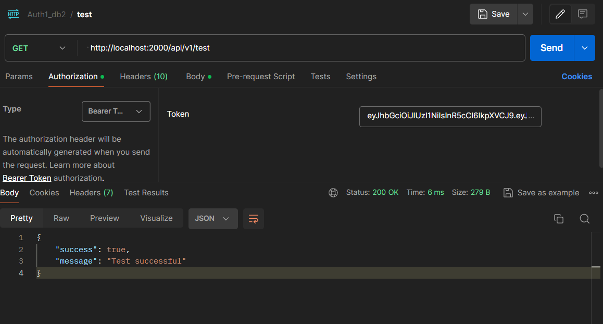

### Token using header

      req.header("Authorization").replace("Bearer ", "");
      key="Authorization" , value = ("Bearer ", "")

### Token using Authorization Tab

# Cookie/token hijacking

Cookie/token hijacking refers to the unauthorized access of a user's cookies or authentication tokens by an attacker. These cookies or tokens are often used to authenticate users and maintain their session state on web applications. When an attacker gains access to these cookies or tokens, they can impersonate the user and perform actions on their behalf, leading to various security risks and potential data breaches.

Here are some common methods used for cookie/token hijacking:

1. **Session Hijacking**: This involves stealing the user's session identifier, which is often stored in a cookie, and using it to impersonate the user's session. Session hijacking can be achieved through various means such as sniffing network traffic, cross-site scripting (XSS) attacks, or exploiting vulnerabilities in the web application.

2. **Cross-Site Scripting (XSS)**: XSS attacks allow attackers to inject malicious scripts into web pages viewed by other users. If the injected script steals cookies or authentication tokens from the victim's browser, the attacker can hijack the victim's session.

3. **Man-in-the-Middle (MitM) Attacks**: In MitM attacks, the attacker intercepts communication between the user and the server. By eavesdropping on the traffic, the attacker can capture cookies or tokens sent over the network, allowing them to hijack the user's session.

4. **Session Fixation**: In a session fixation attack, the attacker sets the session identifier for the victim's session before they log in. Once the victim logs in, the attacker can use the known session identifier to hijack the session.

To prevent cookie/token hijacking, web applications should implement proper security measures such as:

- **Secure Cookie Flags**: Set secure and httpOnly flags on cookies to ensure they are only sent over secure connections (HTTPS) and cannot be accessed by client-side scripts, respectively.
- **Use of Tokens**: Instead of using session cookies, consider using tokens (e.g., JWT) for authentication, which can be more secure and less susceptible to certain attacks.
- **HTTPS Encryption**: Ensure that the entire application is served over HTTPS to encrypt communication between the client and the server, preventing interception of sensitive data.
- **Input Validation**: Implement strict input validation to prevent XSS attacks and other injection vulnerabilities that can be exploited to steal cookies or tokens.
- **Session Management**: Implement session management best practices such as rotating session identifiers, expiring sessions after a period of inactivity, and implementing strong session identifiers to mitigate session fixation attacks.

By implementing these security measures, web applications can reduce the risk of cookie/token hijacking and protect user authentication and session data from unauthorized access.

